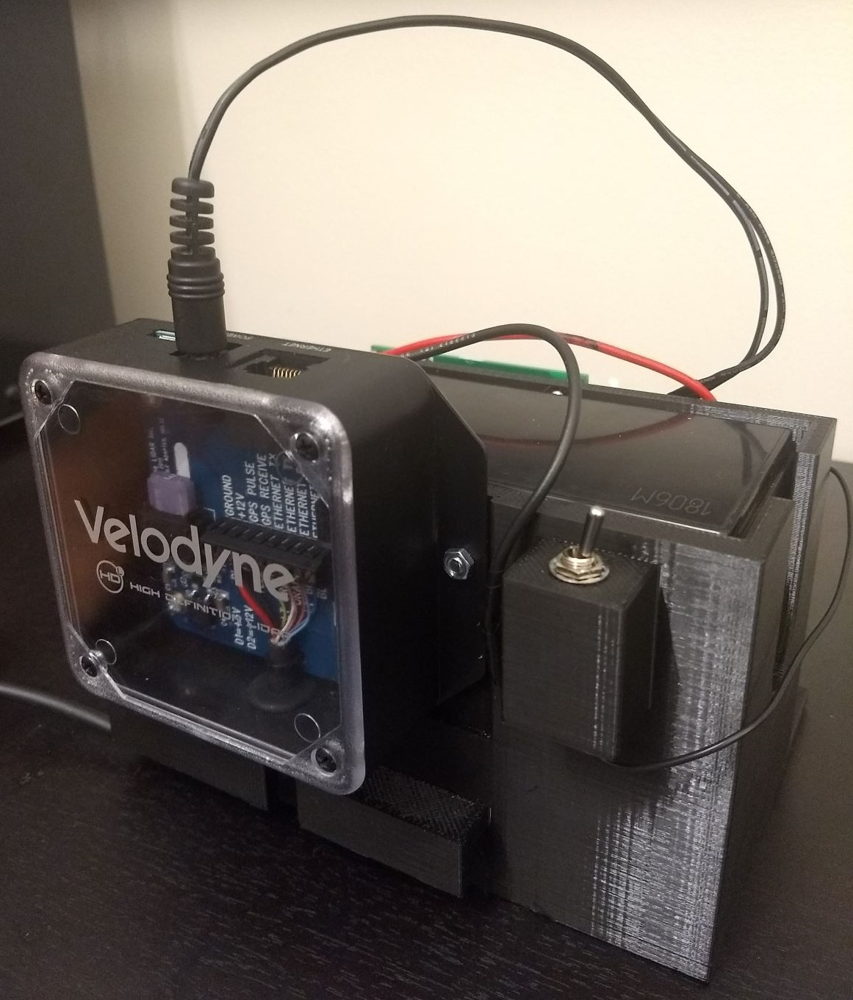

# RAIL Velodyne

This rail_velodyne repository includes custom packages required to install, simulate, and use the Velodyne VLP-16 with the Fetch. The drivers which bring up the physical VLP-16 were forked from [here](https://github.com/ros-drivers/velodyne) while the customized launch files to start the Fetch simluations that include the VLP-16 reuse models from [here](https://bitbucket.org/DataspeedInc/velodyne_simulator).

# Dependencies
Fetch packages for simulation. Please see [their site](http://docs.fetchrobotics.com/index.html) for installation instructions.

## Menu
1. [3D printed Mounts](#3d-printed-mounts) Go here to view the mounts for the VLP-16 and battery on Fetch.
2. [Fetch with Velodyne in Simulation](#fetch-with-velodyne-in-simulation) Go here for simulation install.
3. [Fetch with Velodyne on physical hardware](#fetch-with-velodyne-on-physical-hardware) Go here for robot install.
4. [Toggle the Velodyne on the Fetch](#toggle-the-velodyne-on-the-fetch) Go here to enable/disable Velodyne on robot.

## 3D printed Mounts
Mounts for VLP-16 and battery are found in [here](https://github.com/adaruna3/rail_velodyne/tree/master/fetch_velodyne/hardware). Some images of these mounts are below:




## Fetch with Velodyne in Simulation
This goes through the process of installing and running the simulations for Fetch including the VLP-16.

### Install Fetch / Velodyne Simulator to a PC
1. Begin by installing the Gazebo simulation packages for the VLP-16: `sudo apt-get install ros-indigo-velodyne-simulator`
2. Next clone this repo into a catkin workspace you intend to use.
3. Install dependencies via rosdep: `rosdep install --from-paths src --ignore-src --rosdistro indigo -y`
4. Run `catkin_make` in the catkin workspace to build the pacakges and remember to source the `setup.bash` in the `devel` folder.

### Verify Fetch / Velodyne Simulator Installation
1. Run the simulator via `roslaunch fetch_velodyne playground.launch`. This should begin Gazebo with the Fetch including the VLP-16 on it's pan joint in the defualt playground environment.
2. Check the topics being published via `rostopic list`. There should be a topic called `/velodyne/depth/points`.
3. Visualize the points being published in rviz via `rosrun rviz rviz -f velodyne` using the PointCloud2 rviz pluggin.

## Fetch with Velodyne on physical hardware
This goes through the installation of the VLP-16 and it's drivers into the Fetch. NOTE: To simply use the VLP-16 once it has already been installed (most cases), skip to **Toggle the Velodyne on the Fetch** below.

### Configure Fetch Networking for VLP-16
1. Power the VLP-16 and plug it into Fetch's external Ethernet.
2. Access Fetch via ssh or some other method and modify the `/etc/network/interfaces` file to include the following regarding `eth0` (this will allow the Velodyne to be accessed):
```
auto eth0
iface eth0 inet static
    address 192.168.1.11
    netmask 255.255.255.0
    gateway 192.168.1.1
```
3. Restart Fetch to reset the networking service.

### Verify Fetch Networking Configuration for VLP-16
1. Verify network configuration by running `ifconfig`. The network setting for `eth0` should read similar to `inet addr:192.168.1.11  Bcast:192.168.1.255  Mask:255.255.255.0`
2. Access Fetch via ssh or some other method and open a browser to access the web-server hosted by the VLP-16 at `192.168.1.201`. If networking was set up properly, you should be able to both ping this IP and view the web-server default page *from a web-browser on the Fetch*.

### Install VLP-16 drivers to the Fetch
1. Access Fetch via ssh or some other method and clone this repo into a catkin workspace you intend to use.
2. Access Fetch via ssh or some other method and install dependencies via rosdep for the workspace: `rosdep install --from-paths src --ignore-src --rosdistro indigo -y`
3. Access Fetch via ssh or some other method and run `catkin_make` in the catkin workspace to build the pacakges and remember to source the `setup.bash` in the `devel` folder.

### Verify VLP-16 drivers Installation to the Fetch
1. Access Fetch via ssh or some other method and run `roslaunch velodyne_pointcloud VLP16_points.launch` to start the drivers.
2. Check the topics being published via `rostopic list`. There should be a topic called `/velodyne/depth/points`.
3. Visualize the points being published in rviz via `rosrun rviz rviz -f velodyne` using the PointCloud2 rviz pluggin.

### Configure the Fetch URDF and Startup Services to include the VLP-16
1. This section will be involved, but once properly conifgured the VLP-16 can be toggled by commenting a single line. Begin by locating the startup service that launches all the drivers for the robot. From the Fetch [documentation](http://docs.fetchrobotics.com/computer.html), it should located at `/etc/init/robot.conf`. We will edit this file, but before doing so, save a copy `sudo cp /etc/init/robot.conf /etc/init/robot.conf.bak`.
2. Open the file for editting in vi via `sudo vi /etc/init/robot.conf` Notice this file sources the default ROS `setup.bash` then launches the robot at line 9. Copy this line directly below and modify it to *also* source the workspace where the VLP-16 drivers have been installed as well as launch the robot via a new file we will create called `robot_velodyne.launch`. This should look something like:
```
exec su ros -c ". /opt/ros/indigo/setup.bash && . /PATH_TO_VLP16_DRIVERS/devel/setup.bash && roslaunch /etc/ros/indigo/robot_velodyne.launch --wait"
```
3. Now comment the original line so that instead the line you just wrote gets called. Write the changes and quit vim.
4. Now we will write the file which was just mentioned, `robot_velodyne.launch`. To do this we will use the default file `robot.launch` as a template. Copy this file in the same directory, renaming it accordingly via `sudo cp /etc/ros/indigo/robot.launch /etc/ros/indigo/robot_velodyne.launch`.
5. **Pay attention to the following steps** as *they will differ whether or not the Fetch has been manually calibrated* yet. Open the file in vi via `sudo vi /etc/ros/indigo/robot_velodyne.launch`. If the Fetch *has not been calibrated before*, then modify the line which reads:
```
<!-- URDF -->
<param name="robot_description" textfile="$(find fetch_description)/robots/fetch.urdf" />
```
to
```
<!-- URDF -->
<param name="robot_description" textfile="$(find fetch_velodyne)/robots/fetch_velodyne.urdf" />
```
Otherwise, if the Fetch *has been calibrated before*, it will likely look more like:
```
<!-- URDF -->
<param name="robot_description" textfile="/etc/ros/indigo/CALIBRATION_FILE_NAME.urdf" />
```
in which case you should modify it to

```
<!-- URDF -->
<param name="robot_description" textfile="/etc/ros/indigo/velodyne_CALIBRATION_FILE_NAME.urdf" />
```
6. Before closing this file, we want to add a couple more lines of code to start the VLP-16 drivers. Insert the following code snippet between the `Laser` and `Teleop` drivers to start the Velodyne:
```
<!-- Velodyne -->
<include file="$(find velodyne_pointcloud)/launch/VLP16_points.launch"/>
```
An example file for the case where the Fetch has not be calibrated is in the `launch` folder of the `fetch_velodyne` package titled `robot_velodyne.launch`.

7. Write the changes to the file and quit vi.

8. If the Fetch *has not been calibrated before* skip to configuration verification. Otherwise, if the Fetch *has been calibrated before* please follow this step.  In the step 8, we modified the `robot_velodyne.launch` to reference a URDF which does not exist, therefore we need to create it. To do this, we want to re-use the current calibration which was refernced in step 7. To do this we copy the current calibration's URDF as a template and rename it accordingly via a command *similar* to `sudo cp /etc/ros/indigo/CALIBRATION_FILE_NAME.urdf /etc/ros/indigo/velodyne_CALIBRATION_FILE_NAME.urdf`. Now open that file in an editor with sudo priveleges and add the following code snippet before writing the changes and closing it (from lines 159-223 of the `fetch_velodyne.urdf` inside the `fetch_velodyne` package):
```
<!-- Velodyne VLP-16 Mount -->
  <link name="velodyne_base_link">
    <inertial> <!-- calculated via SolidWorks output -->
      <origin rpy="0 0 0" xyz="0 0 0.0437" />
      <mass value="0.166" />
      <inertia ixx="0.0002" ixy="0.0" ixz="0.0" iyy="0.0002" iyz="0.0" izz="0.0002" />
    </inertial>
    <visual>
      <origin rpy="0 0 0" xyz="0 0 -0.0275" />
      <geometry> <!-- mesh to be added... -->
        <cylinder length="0.055" radius="0.0515"/>
      </geometry>
      <material name="grey">
        <color rgba="0.3 0.3 0.3 1" />
      </material>
    </visual>
    <collision>
      <origin rpy="0 0 0" xyz="0 0 -0.0275" />
      <geometry> <!-- mesh to be added... -->
        <cylinder length="0.055" radius="0.0515"/>
      </geometry>
    </collision>
  </link> 
  <joint name="velodyne_mount_joint" type="fixed">
    <origin rpy="0 0 0" xyz="0.046065 0.000065 0.13735" />
    <parent link="head_pan_link" />
    <child link="velodyne_base_link" />
  </joint>
  <!-- Velodyne VLP-16 -->
  <link name="velodyne_link">
    <inertial>
      <mass value="0.1"/>
      <origin xyz="0 0 -0.0377" />
      <inertia ixx="0.1" ixy="0" ixz="0" iyy="0.1" iyz="0" izz="0.1"/>
    </inertial>
    <visual>
      <origin xyz="0 0 -0.0377" />
      <geometry>
        <mesh filename="package://velodyne_description/meshes/VLP16_base_1.dae" />
      </geometry>
    </visual>
    <visual>
      <origin xyz="0 0 -0.0377" />
      <geometry>
        <mesh filename="package://velodyne_description/meshes/VLP16_base_2.dae" />
      </geometry>
    </visual>
    <visual>
      <origin xyz="0 0 -0.0377" />
      <geometry>
        <mesh filename="package://velodyne_description/meshes/VLP16_scan.dae" />
      </geometry>
    </visual>
    <collision>
      <origin rpy="0 0 0" xyz="0 0 -0.00185"/>
      <geometry>
        <cylinder radius="0.0516" length="0.0717"/>
      </geometry>
    </collision>
  </link>
  <joint name="velodyne_joint" type="fixed">
    <origin xyz="0 0 0.0377" rpy="0 0 0" />
    <parent link="velodyne_base_link"/>
    <child link="velodyne_link"/>
  </joint>
```
### Verify the Fetch URDF and Startup Services Configuration to include the VLP-16
1. Restart the Fetch with the VLP-16 plugged into the Fetch via ethernet and powered on.
2. Access Fetch via ssh or some other method and run `rostopic list`. Now the topic `/velodyne/depth/points` should be getting published by default.
3. Run rviz via `rosrun rviz rviz` and add the robot model pluggin as needed to view the robot URDF. It should now include the VLP-16.
4. Visualize the points being published in rviz using the PointCloud2 rviz pluggin.
5. Installation is complete.

## Toggle the Velodyne on the Fetch
### Enable the VLP-16
1. Run `sudo vi /etc/init/robot.conf`
2. Uncomment the `exec` line that contains the word `velodyne`
3. Comment the `exec` line that does not contain the word `velodyne`

### Disable the VLP-16
1. Run `sudo vi /etc/init/robot.conf`
2. Comment the `exec` line that contains the word `velodyne`
3. Unomment the `exec` line that does not contain the word `velodyne`
